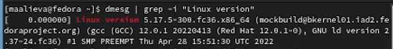
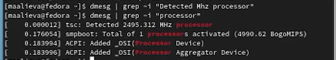
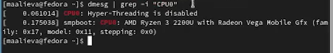
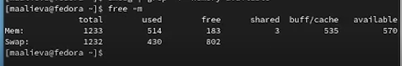
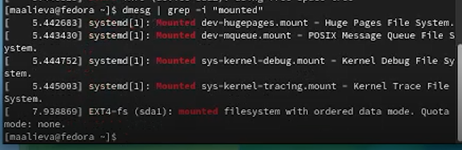

---
## Front matter
title: "Отчёт по лабораторной работе №1"
subtitle: "Дисциплина: Операционные системы"
author: "Алиева Милена Арифовна"

## Generic otions
lang: ru-RU
toc-title: "Содержание"

## Bibliography
bibliography: bib/cite.bib
csl: pandoc/csl/gost-r-7-0-5-2008-numeric.csl

## Pdf output format
toc: true # Table of contents
toc-depth: 2
lof: true # List of figures
lot: true # List of tables
fontsize: 12pt
linestretch: 1.5
papersize: a4
documentclass: scrreprt
## I18n polyglossia
polyglossia-lang:
  name: russian
  options:
	- spelling=modern
	- babelshorthands=true
polyglossia-otherlangs:
  name: english
## I18n babel
babel-lang: russian
babel-otherlangs: english
## Fonts
mainfont: PT Serif
romanfont: PT Serif
sansfont: PT Sans
monofont: PT Mono
mainfontoptions: Ligatures=TeX
romanfontoptions: Ligatures=TeX
sansfontoptions: Ligatures=TeX,Scale=MatchLowercase
monofontoptions: Scale=MatchLowercase,Scale=0.9
## Biblatex
biblatex: true
biblio-style: "gost-numeric"
biblatexoptions:
  - parentracker=true
  - backend=biber
  - hyperref=auto
  - language=auto
  - autolang=other*
  - citestyle=gost-numeric
## Pandoc-crossref LaTeX customization
figureTitle: "Рис."
tableTitle: "Таблица"
listingTitle: "Листинг"
lofTitle: "Список иллюстраций"
lotTitle: "Список таблиц"
lolTitle: "Листинги"
## Misc options
indent: true
header-includes:
  - \usepackage{indentfirst}
  - \usepackage{float} # keep figures where there are in the text
  - \floatplacement{figure}{H} # keep figures where there are in the text
---

# Цель работы

Целью данной работы является приобретение практических навыков установки операционной системы на виртуальную машину, настройки минимально необходимых для дальнейшей работы сервисов.

# Задание

1) Запуск VirtualBox и создание новой виртуальной машины (Linux, Fedora).
2) Настройка установки операционной системы.
3) Перезапуск виртуальной машины, установление имени и пароля пользователя.

# Теоретическое введение

Операционная система (ОС) — это комплекс взаимосвязанных программ, предназначенных для управления ресурсами компьютера и организации взаимодействия с пользователем. GNU Linux — семейство переносимых, многозадачных и многопользовательских операционных систем, на базе ядра Linux, включающих тот или иной набор утилит и программ проекта GNU, и, возможно, другие компоненты. Дистрибутив GNU Linux — общее определение ОС, использующих ядро Linux и набор библиотек и утилит, выпускаемых в рамках проекта GNU, а также графическую оконную подсистему X Window System.

# Выполнение лабораторной работы

1) Создаём новую виртуальную машину, для этого в VirtualBox выбираем Машина, затем Создать. Указываем имя, выбираем Linux, Fedora. Указываем также размер основной памяти виртуальной машины - от 2048 МБ. Задаём конфигурацию жёсткого диска - загрузочный, VDI, динамический виртуальный диск. Также задаём размер диска - 80 ГБ. 

2) Запускаем виртуальную машину(Install to Hard Drive), выбираем язык. Переходим к настройкам. Корректируем часовой пояс, раскладку клавиатуры.

3) После установки этих настроек продолжаем саму установку. Нажимаем Начать установку, после установки выключаем машину.

4) Далее изымаем образ диска из дисковода. Запускаем машину заново. После этого начинаем настройку Fedora Linux 36. Соглашаемся с Политикой Конфиденциальности. Последующие настройки оставляем без изменения. Затем задаем имя учетной записи и устанавливаем пароль. 

5) Виртуальная машина готова к работе.

6) Домашняя работа:

Используем поиск с помощью команды grep. Получим следующую информацию:

Версия ядра Linux (Linux version) (рис. [-@fig:001])

{ #fig:001 width=70% }

Частота процессора (Detected Mhz processor) (рис. [-@fig:002])

{ #fig:002 width=70% }

Модель процессора (CPU0) (рис. [-@fig:003])

{ #fig:003 width=70% }

Объём доступной оперативной памяти (Memory available) (рис. [-@fig:004])

{ #fig:004 width=70% }

Тип обнаруженного гипервизора (Hypervisor detected) (рис. [-@fig:005])

{ #fig:005 width=70% }

Последовательность монтирования файловых систем (рис. [-@fig:006])

{ #fig:006 width=70% }

7) Контрольные вопросы:

1. Какую информацию содержит учётная запись пользователя?
Имя пользователя, зашифрованный пароль пользователя, идентификационный номер пользователя, домашний каталог пользователя, командный интерпретатор пользователя, идентификационный номер группы пользователя.

2. Укажите команды терминала:
а) для получения справки по команде: man <название команды>
б) для перемещения по файловой системе: cd
в) для просмотра содержимого каталога: ls
г) для определения объёма каталога: du <название каталога>
д) для создания каталогов: mkdir <имя каталога>
для удаления каталогов: rm <имя каталога>
для создания файлов: touch <имя файла>
для удаления файлов: rm -r <имя файла>
е) для задания определённых прав на файл / каталог: chmod + x <имя файла/каталога>
ж) для просмотра истории команд: history

3. Что такое файловая система? Приведите примеры с краткой характеристикой.
Файловая система - часть операционной системы назначений которой в том, чтобы обеспечить пользователю удобный интерфейс при работе с данными, хранящимися на диске.

Примеры файловых систем: Ext2, Ext 3, Ext4 - стандартная файловая система Linux
XFS - высокопроизводительная файловая система, ее преимущество в высокой скорости работы с большими файлами, отложенном выделении места и в быстром увеличении разделов

4. Как посмотреть, какие файловые системы подмонтированы в ОС?
Это делается с помощью коман mount

5. Как удалить зависший процесс?
С помощью команды kill

# Выводы

В результате выполнения лабораторной работы №1 я приобрела навыки установки операционной системы на виртуальную машину, а также научилась устанавливать необходимые настройки для дальнейшей работы.

# Список литературы{.unnumbered}

::: {#refs}
:::
