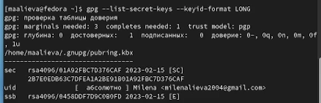

---
## Front matter
title: "Лабораторная работа №2"
subtitle: "Дисциплина: Операционные системы"
author: "Алиева Милена Арифовна"

## Generic otions
lang: ru-RU
toc-title: "Содержание"

## Bibliography
bibliography: bib/cite.bib
csl: pandoc/csl/gost-r-7-0-5-2008-numeric.csl

## Pdf output format
toc: true # Table of contents
toc-depth: 2
lof: true # List of figures
lot: true # List of tables
fontsize: 12pt
linestretch: 1.5
papersize: a4
documentclass: scrreprt
## I18n polyglossia
polyglossia-lang:
  name: russian
  options:
	- spelling=modern
	- babelshorthands=true
polyglossia-otherlangs:
  name: english
## I18n babel
babel-lang: russian
babel-otherlangs: english
## Fonts
mainfont: PT Serif
romanfont: PT Serif
sansfont: PT Sans
monofont: PT Mono
mainfontoptions: Ligatures=TeX
romanfontoptions: Ligatures=TeX
sansfontoptions: Ligatures=TeX,Scale=MatchLowercase
monofontoptions: Scale=MatchLowercase,Scale=0.9
## Biblatex
biblatex: true
biblio-style: "gost-numeric"
biblatexoptions:
  - parentracker=true
  - backend=biber
  - hyperref=auto
  - language=auto
  - autolang=other*
  - citestyle=gost-numeric
## Pandoc-crossref LaTeX customization
figureTitle: "Рис."
tableTitle: "Таблица"
listingTitle: "Листинг"
lofTitle: "Список иллюстраций"
lotTitle: "Список таблиц"
lolTitle: "Листинги"
## Misc options
indent: true
header-includes:
  - \usepackage{indentfirst}
  - \usepackage{float} # keep figures where there are in the text
  - \floatplacement{figure}{H} # keep figures where there are in the text
---

# Цель работы

Целью работы является изучить идеологию и применение средств контроляверсий git. Приобрести практические навыки по работе с системой git.

# Задание

1) Базовая настройка git
2) Создание SSH ключа
3) Создание GPG ключа
4) Создание рабочего пространства и репозитория курса на основе
шаблона
5) Настройка каталога курса

# Теоретическое введение

Система контроля версий Git представляет собой набор программ командной строки. Доступ к ним можно получить из терминала посредством ввода команды git с различными опциями

Также перечислим наиболее часто используемые команды git.

Создание основного дерева репозитория: git init
Получение обновлений (изменений) текущего дерева из центрального репозитория: git pull
Отправка всех произведённых изменений локального дерева в центральный репозиторий: git push
Просмотр списка изменённых файлов в текущей директории: git status
Просмотр текущих изменений: git diff
# Выполнение лабораторной работы

1.  Сначала сделаем предварительную конфигурацию git. Откроем терминал и введём следующие команды, указав имя и email владельца репозитория и настроим utf-8 в выводе сообщений git (рис. [-@fig:001])

{ #fig:001 width=70% }

2. Зададим имя начальной ветки (будем называть её master), также зададим параметры autocrlf и safecrlf (рис. [-@fig:002])

{ #fig:002 width=70% }

3. Для последующей идентификации пользователя на сервере репозиториев сгенерируем пару ключей (приватный и открытый) (рис. [-@fig:003])

{ #fig:003 width=70% }

4. Далее загрузим сгенерённый открытый ключ. Для этого зайдём на сайт под своей учетной записью и перейдем в Setting, затем в боковом меню выберем SSH and GPG keys и нажмём на New SSH key. Скопировав из локальной консоли ключ в буфер обмена вставляем ключ в появившееся на сайте поле и указываем для ключа имя (Title)(рис. [-@fig:004])

{ #fig:004 width=70% }

5. Для последующей идентификации пользователя на сервере репозиториев сгенерируем Gpg ключ (рис. [-@fig:005])

{ #fig:005 width=70% }

6. Сгенерённый GPG ключ (рис. [-@fig:006]) 

{ #fig:006 width=70% }

7. Авторизация на гитхаб (рис. [-@fig:007])

{ #fig:007 width=70% }

8. Создадим репозиторий на основе шаблона можно через web-интерфейс github. Перейдём на станицу репозитория с шаблоном курса, выберем Use this template. В открывшемся окне зададим имя репозитория (Repository name) study_2022–2023_os-intro и создадим репозиторий (Create repository from template) (рис. [-@fig:008])

{ #fig:008 width=70% }

9. Откроем терминал и перейдем в каталог курса. Клонируем созданный репозиторий(рис. [-@fig:009])

{ #fig:009 width=70% }

10. Проверим правильность выполнения, найдем папку "Операционные системы" и пройдем по ней (рис. [-@fig:010]) 

{ #fig:010 width=70% }

11. Перейдем в каталог курса и удалим лишние файлы. Создадим необходимые каталоги и отправим файлы на сервер (рис. [-@fig:011])

{ #fig:011 width=70% }

# Ответы на контрольные вопросы

1. Что такое системы контроля версий (VCS) и для решения каких задач они предназначаются?
Система контроля версий — программное обеспечение для облегчения работы с изменяющейся информацией. Система управления версиями позволяет хранить несколько версий одного и того же документа, при необходимости возвращаться к более ранним версиям, определять, кто и когда сделал то или иное изменение, и многое другое. Системы контроля версий (Version Control System, VCS) успешно применяются при работе нескольких человек над одним проектом. Обычно основное дерево проекта хранится в локальном или удалённом репозитории, к которому настроен доступ для участников проекта. При внесении изменений в содержание проекта система контроля версий позволяет их фиксировать, совмещать изменения, произведённые разными участниками проекта, производить откат к любой более ранней версии проекта, если это требуется.

2. Объясните следующие понятия VCS и их отношения: хранилище, commit, история, рабочая копия.
Репозиторий - хранилище версий - в нем хранятся все документы вместе с историей их изменения и другой служебной информацией. 
Commit — отслеживание изменений, сохраняет разницу в изменениях. 
Рабочая копия - копия проекта, связанная с репозиторием (текущее состояние файлов проекта, основанное на версии из хранилища

3. Что представляют собой и чем отличаются централизованные и децентрализованные VCS? Приведите примеры VCS каждого вида.
В централизованном - одно основное хранилище всего проекта; каждый пользователь копирует необходимые ему файлы из репозитория, изменяет и, затем, добавляет свои изменения обратно
В децентрализованном - у каждого пользователя свой вариант (возможно не один) репозитория; присутствует возможность добавлять и забирать изменения из любого репозитория.

4. Опишите действия с VCS при единоличной работе с хранилищем.
Необходимо создать и подключить удаленный репозиторий. Затем по мере изменения проекта отправлять эти изменения на сервер.

5. Опишите порядок работы с общим хранилищем VCS.
Пользователь получает нужную версию файлов. После того, как он внес необходимые изменения, пользователь размещает новую версию в хранилище.

6. Каковы основные задачи, решаемые инструментальным средством git?
Обеспечить удобство командной работы, хранить информацию о всех изменениях.

7. Назовите и дайте краткую характеристику командам git.
Создание основного дерева репозитория: git init
Получение обновлений (изменений) текущего дерева из центрального репозитория: git pull
Отправка всех произведённых изменений локального дерева в центральный репозиторий: git push
Просмотр списка изменённых файлов в текущей директории: git status
Просмотр текущих изменений: git diff
добавить все изменённые и/или созданные файлы и/или каталоги: git add .
добавить конкретные изменённые и/или созданные файлы и/или каталоги: git add имена_файлов
удалить файл и/или каталог из индекса репозитория (при этом файл и/или каталог остаётся в локальной директории): git rm имена_файлов

8. Приведите примеры использования при работе с локальным и удалённым репозиториями.
Отправка всех произведённых изменений локального дерева в центральный репозиторий: git push

9. Что такое ветви и зачем могут быть нужны ветви (branches)?
Ветвь - один из параллельных участков истории в одном хранилище, исходящих их одной версии. Между ветками возможно слияние, что используется для создания новых функций.

10. Как и зачем можно игнорировать некоторые файлы при commit?
Есть такие файлы, зачастую временные, которые не нужно добавлять в репозиторий (например, объектные файлы). Так, можно прописать шаблоны игнорируемых при добавлении в репозиторий файлов.

# Выводы

В ходе выполнения лабораторной работы я изучила идеологию и применение средств контроля версий git, а также приобрела практические навыки по работе с системой git. 

