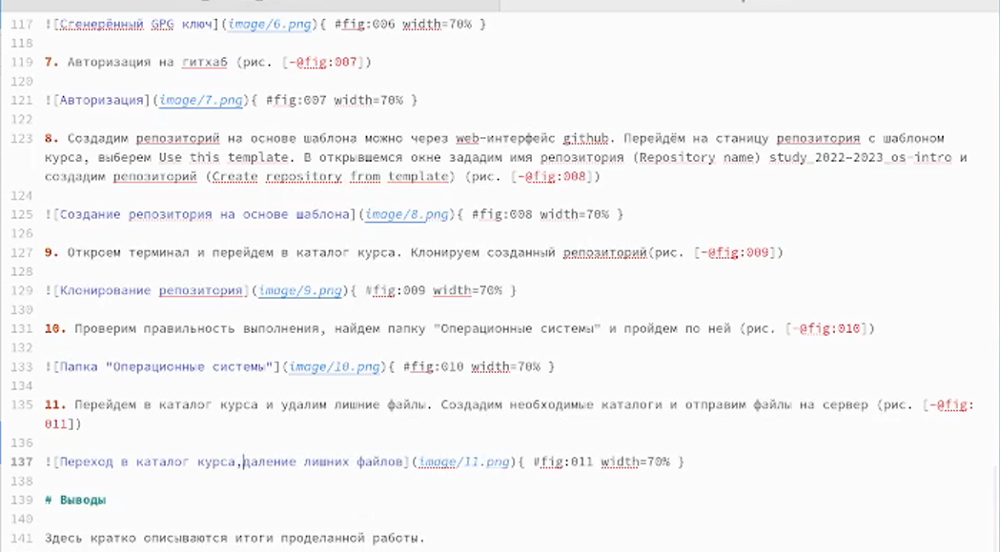
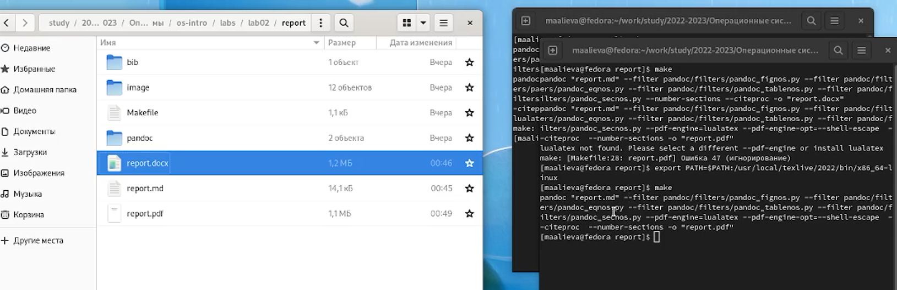

---
## Front matter
title: "Лабораторная работа №3"
subtitle: "Дисциплина: Операционные системы"
author: "Алиева Милена Арифовна"

## Generic otions
lang: ru-RU
toc-title: "Содержание"

## Bibliography
bibliography: bib/cite.bib
csl: pandoc/csl/gost-r-7-0-5-2008-numeric.csl

## Pdf output format
toc: true # Table of contents
toc-depth: 2
lof: true # List of figures
lot: true # List of tables
fontsize: 12pt
linestretch: 1.5
papersize: a4
documentclass: scrreprt
## I18n polyglossia
polyglossia-lang:
  name: russian
  options:
	- spelling=modern
	- babelshorthands=true
polyglossia-otherlangs:
  name: english
## I18n babel
babel-lang: russian
babel-otherlangs: english
## Fonts
mainfont: PT Serif
romanfont: PT Serif
sansfont: PT Sans
monofont: PT Mono
mainfontoptions: Ligatures=TeX
romanfontoptions: Ligatures=TeX
sansfontoptions: Ligatures=TeX,Scale=MatchLowercase
monofontoptions: Scale=MatchLowercase,Scale=0.9
## Biblatex
biblatex: true
biblio-style: "gost-numeric"
biblatexoptions:
  - parentracker=true
  - backend=biber
  - hyperref=auto
  - language=auto
  - autolang=other*
  - citestyle=gost-numeric
## Pandoc-crossref LaTeX customization
figureTitle: "Рис."
tableTitle: "Таблица"
listingTitle: "Листинг"
lofTitle: "Список иллюстраций"
lotTitle: "Список таблиц"
lolTitle: "Листинги"
## Misc options
indent: true
header-includes:
  - \usepackage{indentfirst}
  - \usepackage{float} # keep figures where there are in the text
  - \floatplacement{figure}{H} # keep figures where there are in the text
---

# Цель работы

Научиться оформлять отчёты с помощью легковесного языка разметки Markdown

# Задание

1.	Провести компиляцию шаблона с использованием Makefile.
2.	Сделать отчёт по второй лабораторной работе в формате markdown.
3.	Загрузить файлы на github.

# Теоретическое введение

Чтобы создать заголовок, используйте знак #, например:
 # This is heading 1 
## This is heading 2 
### This is heading 3 
#### This is heading 4 
Чтобы задать для текста полужирное начертание, заключите его в двойные звездочки:
 This text is **bold**
Чтобы задать для текста курсивное начертание, заключите его в одинарные звездочки: 
*This text is italic*
Чтобы задать для текста полужирное и курсивное начертание, заключите его в тройные звездочки: 
This is text is both ***bold and italic***

# Выполнение лабораторной работы

1.  Редактирование шаблона в формате markdown, затем его сохранение. (рис. [-@fig:001])

{ #fig:001 width=70% }

2. Обновление локального репозитория и проведение компиляции шаблона с использованием Makefile (рис. [-@fig:002])

{ #fig:002 width=70% }

# Выводы

В ходе данной работы я освоила процедуры оформления отчетов с помощью легковесного языка разметки Markdown.

