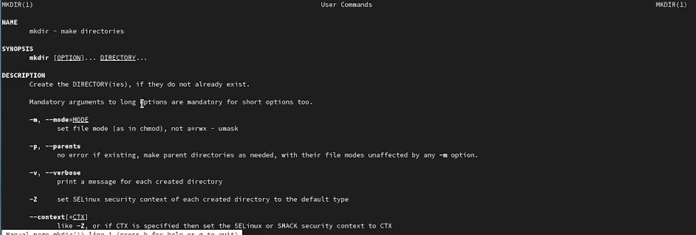

---
## Front matter
title: "Лабораторная работа №4"
subtitle: "Дисциплина: Операционные системы"
author: "Алиева Милена Арифовна"

## Generic otions
lang: ru-RU
toc-title: "Содержание"

## Bibliography
bibliography: bib/cite.bib
csl: pandoc/csl/gost-r-7-0-5-2008-numeric.csl

## Pdf output format
toc: true # Table of contents
toc-depth: 2
lof: true # List of figures
lot: true # List of tables
fontsize: 12pt
linestretch: 1.5
papersize: a4
documentclass: scrreprt
## I18n polyglossia
polyglossia-lang:
  name: russian
  options:
	- spelling=modern
	- babelshorthands=true
polyglossia-otherlangs:
  name: english
## I18n babel
babel-lang: russian
babel-otherlangs: english
## Fonts
mainfont: PT Serif
romanfont: PT Serif
sansfont: PT Sans
monofont: PT Mono
mainfontoptions: Ligatures=TeX
romanfontoptions: Ligatures=TeX
sansfontoptions: Ligatures=TeX,Scale=MatchLowercase
monofontoptions: Scale=MatchLowercase,Scale=0.9
## Biblatex
biblatex: true
biblio-style: "gost-numeric"
biblatexoptions:
  - parentracker=true
  - backend=biber
  - hyperref=auto
  - language=auto
  - autolang=other*
  - citestyle=gost-numeric
## Pandoc-crossref LaTeX customization
figureTitle: "Рис."
tableTitle: "Таблица"
listingTitle: "Листинг"
lofTitle: "Список иллюстраций"
lotTitle: "Список таблиц"
lolTitle: "Листинги"
## Misc options
indent: true
header-includes:
  - \usepackage{indentfirst}
  - \usepackage{float} # keep figures where there are in the text
  - \floatplacement{figure}{H} # keep figures where there are in the text
---

# Цель работы

Приобретение практических навыков взаимодействия пользователя с системой посредством командной строки.

# Задание

1. Определите полное имя вашего домашнего каталога. Далее относительно этого каталога будут выполняться последующие упражнения. 
2. Выполните следующие действия: 2.1. Перейдите в каталог /tmp. 2.2. Выведите на экран содержимое каталога /tmp.Для этого используйте команду ls с различными опциями. Поясните разницу в выводимой на экран информации. 2.3. Определите, есть ли в каталоге /var/spool подкаталог с именем cron? 2.4. Перейдите в Ваш домашний каталог и выведите на экран его содержимое. Определите, кто является владельцем файлов и подкаталогов? 
3. Выполните следующие действия: 3.1. В домашнем каталоге создайте новый каталог с именем newdir. 3.2. В каталоге ~/newdir создайте новый каталог с именем morefun. 3.3. В домашнем каталоге создайте одной командой три новых каталога с именами letters, memos, misk. Затем удалите эти каталоги одной командой. 3.4. Попробуйте удалить ранее созданный каталог ~/newdir командой rm. Проверьте, был ли каталог удалён. 3.5. Удалите каталог ~/newdir/morefun из домашнего каталога. Проверьте, был ли каталог удалён. 
4. С помощью команды man определите, какую опцию команды ls нужно использовать для просмотра содержимое не только указанного каталога, но и подкаталогов, входящих в него. 
5. С помощью команды man определите набор опций команды ls,позволяющий отсортировать по времени последнего изменения выводимый список содержимого каталога с развёрнутым описанием файлов. 
6. Используйте команду man для просмотра описания следующих команд: cd,pwd,mkdir, rmdir, rm. Поясните основные опции этих команд. 
7. Используя информацию, полученную при помощи команды history, выполните модификацию и исполнение нескольких команд из буфера команд.

# Теоретическое введение

Основным интерфейсом взаимодействия пользователя с операционной системой UNIX во всех её модификациях была и остается командная строка. Командная строка (или «консоль») – это текстовый интерфейс между человеком и компьютером, в котором инструкции компьютеру даются путём ввода с клавиатуры текстовых строк (команд). Интерфейс командной строки противопоставляется управлению программами на основе меню, а также различным реализациям графического интерфейса. Команды, введённые пользователем, интерпретируются и выполняются специальной программой — командной оболочкой.

# Выполнение лабораторной работы

1.  Сначала определим имя домашнего каталога (рис. [-@fig:001])

{ #fig:001 width=70% }

2. Затем перейдем в каталог /tmp (рис. [-@fig:002])

{ #fig:002 width=70% }

3. Определим содержимое каталога /tmp с помощью команды ls. Также рассмотрим работу данной команды с различными опциями. Например, опция -а отображает дополнительно имена скрытых файлов. Опция -l позволяет подробную информацию о сайтах и каталогах (рис. [-@fig:003])

{ #fig:003 width=70% }

4. Создадим в домашнем каталоге новый каталог с именем newdir. В этом новом каталоге создадим каталог morefun. Также одной командой создадим три каталога - letters, memos, misk (рис. [-@fig:004])

{ #fig:004 width=70% }

5. Удаляем созданные каталоги с помощью команды rmdir, команда rm не позволяет удалить каталог newdir (рис. [-@fig:005])

{ #fig:005 width=70% }

6. С помощью команды man ls смотрим, какую опцию нужно использовать для просмотра содержимого не только указанного каталога, но и подкаталогов. Это опция -R (рис. [-@fig:006])

{ #fig:006 width=70% }

7. С помощью команды man ls смотрим, какую опцию нужно использовать для отсортировки по времени последних изменений выводимого списка содержимого каталога с развернутым описанием файлов. Это опция -t (рис. [-@fig:007])

{ #fig:007 width=70% }

8. Используем команду man для просмотра описания следующих команд: cd (рис. [-@fig:008])

{ #fig:008 width=70% }

pwd: (рис. [-@fig:009])

{ #fig:009 width=70% }

mkdir: (рис. [-@fig:010]) 

{ #fig:010 width=70% }

rmdir: (рис. [-@fig:011])

{ #fig:011 width=70% }

rm: (рис. [-@fig:012])

{ #fig:012 width=70% }

9. Используем команду history для просмотра использованных команд (рис. [-@fig:013])

{ #fig:013 width=70% }

10. Выполним команду из буфера команд (рис. [-@fig:014])

{ #fig:014 width=70% }

11. Выполним модификацию команды из буфера команд (рис. [-@fig:015])

{ #fig:015 width=70% }

# Ответы на контрольные вопросы

1) Что такое командная строка? 
Командная строка (или «консоль») – это текстовый интерфейс между человеком и компьютером, в котором инструкции компьютеру даются путём ввода с клавиатуры текстовых строк (команд). Интерфейс командной строки противопоставляется управлению программами на основе меню, а также различным реализациям графического интерфейса. Команды, введённые пользователем, интерпретируются и выполняются специальной программой — командной оболочкой.

2) При помощи какой команды можно определить абсолютный путь текущего каталога? 
Для определения абсолютного пути к текущему каталогу используется команда pwd (print working directory).

3) При помощи какой команды и каких опций можно определить только тип файлов и их имена в текущем каталоге? Приведите примеры. При помощи команды ls -F. (ls -F install-tl-unx/ newdir/ work/ Видео/ Документы/ Загрузки/ Изображения/ Музыка/ Общедоступные/ 'Рабочий стол'/ Шаблоны/)

4) Каким образом отобразить информацию о скрытых файлах? 
С помощью команды ls -a. 

5) При помощи каких команд можно удалить файл и каталог? Можно ли это сделать одной и той же командой? Приведите примеры. 
Команда rm используется для удаления файлов и каталогов. Если каталог пуст, то можно воспользоваться командой rmdir. Если удаляемый каталог содержит файлы, то команда не будет выполнена — нужно использовать rm - r.

6) Каким образом можно вывести информацию о последних выполненных пользователем командах? работы? 
С помощью команды history.

7) Как воспользоваться историей команд для их модифицированного выполнения? Приведите примеры. 
Можно модифицировать команду из выведенного на экран списка при помощи следующей конструкции: !<номер_команды>:s/<что_меняем>/<на_что_меняем> (!3:s/a/F ls -F).

8) Приведите примеры запуска нескольких команд в одной строке. 
Если требуется выполнить последовательно несколько команд, записанный в одной строке, то для этого используется символ точка с запятой (cd; ls).

9) Дайте определение и приведите примера символов экранирования. 
Если в заданном контексте встречаются специальные символы (типа «.», «/», «*» и т.д.), надо перед ними поставить символ экранирования \ (слэш).

10) Охарактеризуйте вывод информации на экран после выполнения команды ls с опцией l. 
Чтобы вывести на экран подробную информацию о файлах и каталогах, необходимо использовать опцию l. При этом о каждом файле и каталоге будет выведена следующая информация: – тип файла, – право доступа, – число ссылок, – владелец, – размер, – дата последней ревизии, – имя файла или каталога.

11) Что такое относительный путь к файлу? Приведите примеры использования относительного и абсолютного пути при выполнении какой-либо команды. 
Относительный путь — это ссылка, указывающая на другие страницы вашего сайта относительно веб-страницы, на которой эта ссылка уже находится. 
Пример относительно пути: ./docs/files/file.txt 
Пример абсолютного пути: cd /home/maalieva/work

12) Как получить информацию об интересующей вас команде? 
С помощью команды hepl.

13) Какая клавиша или комбинация клавиш служит для автоматического дополнения вводимых команд? 
Клавиша Tab.

# Выводы

Я приобрела практические навыки взаимодействия пользователя с системой посредством командной строки.
