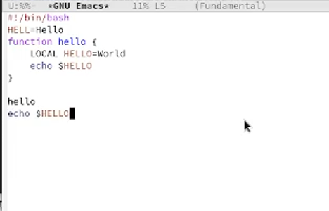

---
## Front matter
title: "Лабораторная работа №9"
subtitle: "Дисциплина: Операционные системы"
author: "Алиева Милена Арифовна"

## Generic otions
lang: ru-RU
toc-title: "Содержание"

## Bibliography
bibliography: bib/cite.bib
csl: pandoc/csl/gost-r-7-0-5-2008-numeric.csl

## Pdf output format
toc: true # Table of contents
toc-depth: 2
lof: true # List of figures
lot: true # List of tables
fontsize: 12pt
linestretch: 1.5
papersize: a4
documentclass: scrreprt
## I18n polyglossia
polyglossia-lang:
  name: russian
  options:
	- spelling=modern
	- babelshorthands=true
polyglossia-otherlangs:
  name: english
## I18n babel
babel-lang: russian
babel-otherlangs: english
## Fonts
mainfont: PT Serif
romanfont: PT Serif
sansfont: PT Sans
monofont: PT Mono
mainfontoptions: Ligatures=TeX
romanfontoptions: Ligatures=TeX
sansfontoptions: Ligatures=TeX,Scale=MatchLowercase
monofontoptions: Scale=MatchLowercase,Scale=0.9
## Biblatex
biblatex: true
biblio-style: "gost-numeric"
biblatexoptions:
  - parentracker=true
  - backend=biber
  - hyperref=auto
  - language=auto
  - autolang=other*
  - citestyle=gost-numeric
## Pandoc-crossref LaTeX customization
figureTitle: "Рис."
tableTitle: "Таблица"
listingTitle: "Листинг"
lofTitle: "Список иллюстраций"
lotTitle: "Список таблиц"
lolTitle: "Листинги"
## Misc options
indent: true
header-includes:
  - \usepackage{indentfirst}
  - \usepackage{float} # keep figures where there are in the text
  - \floatplacement{figure}{H} # keep figures where there are in the text
---

# Цель работы

Познакомиться с операционной системой Linux. Получить практические навыки работы с редактором Emacs.

# Задание

1. Ознакомиться с теоретическим материалом.
2. Ознакомиться с редактором emacs.
3. Выполнить упражнения.
4. Ответить на контрольные вопросы.

# Теоретическое введение

Emacs представляет собой мощный экранный редактор текста, написанный на языке высокого уровня Elisp.

Определение 1. Буфер — объект, представляющий какой-либо текст.

Определение 2. Фрейм соответствует окну в обычном понимании этого слова. Каждый
фрейм содержит область вывода и одно или несколько окон Emacs.
 
Определение 3. Окно — прямоугольная область фрейма, отображающая один из буферов.

Определение 4. Область вывода — одна или несколько строк внизу фрейма, в которой Emacs выводит различные сообщения, а также запрашивает подтверждения и дополнительную информацию от пользователя.

Определение 5. Минибуфер используется для ввода дополнительной информации и всегда отображается в области вывода.

Определение 6. Точка вставки — место вставки (удаления) данных в буфере.

# Выполнение лабораторной работы

1. Открыли emacs, создали файл lab07.sh с помощью комбинации Ctrl-x Ctrl-f (C-x C-f) и набрали нужный текст:
(рис. [-@fig:001])

{ #fig:001 width=70% }

2. Сохранили файл с помощью комбинации Ctrl-x Ctrl-s (C-x C-s), проделали с текстом стандартные процедуры редактирования, вырезали одной командой целую строку (С-k)(C-y).(рис. [-@fig:002])

{ #fig:002 width=70% }

И вставили эту строку в конец файла (рис. [-@fig:003])

{ #fig:003 width=70% }

3. Выделили область текста (C-space), скопировали область в буфер обмена (M-w), вставили область в конец файла (рис. [-@fig:004])

{ #fig:004 width=70% }

4. Вновь выделили эту область и на этот раз вырезали её (C-w), затем отменили последнее действие (C-/).  (рис. [-@fig:005])

{ #fig:005 width=70% }

5. Далее научились использовать команды по перемещению курсора:
- Переместите курсор в начало строки (C-a).
- Переместите курсор в конец строки (C-e).
- Переместите курсор в начало буфера (M-<).
- Переместите курсор в конец буфера (M->).

6. Вывели список активных буферов на экран (C-x C-b). (рис. [-@fig:006])

{ #fig:006 width=70% }

7. Переместились во вновь открытое окно (C-x) o со списком открытых буферов и переключились на другой буфер, затем закрыли это окно (C-x 0) (рис. [-@fig:007])

{ #fig:007 width=70% }

8. Поделили фрейм на 4 части: разделили фрейм на два окна по вертикали (C-x 3), а затем каждое из этих окон на две части по горизонтали (C-x 2) (рис. [-@fig:008])

{ #fig:008 width=70% }

9. В каждом из четырёх созданных окон открыли новый буфер (файл) и ввели несколько строк текста. Затем переключились в режим поиска (C-s) и нашли несколько слов, присутствующих в тексте. Переключались между результатами поиска, нажимая C-s и вышли из режима поиска, нажав C-g (рис. [-@fig:009])

{ #fig:009 width=70% }

10. Перешли в режим поиска и замены (M-%), ввели текст, который следует найти и заменить, нажали Enter, затем ввели текст для замены (World на Planet) (рис. [-@fig:010]) 

{ #fig:010 width=70% }

11. Испробовали другой режим поиска, нажав M-s o (рис. [-@fig:011])

{ #fig:011 width=70% }

#Ответы на контрольные вопросы

1. Кратко охарактеризуйте редактор emacs.

Emacs — один из наиболее мощных и широко распространённых редакторов, используемых в мире UNIX. Написан на языке высокого уровня Lisp.

2. Какие особенности данного редактора могут сделать его сложным для освоения новичком?

Большое разнообразие комбинаций клавиш, которые необходимы для редактирования файла.

3. Своими словами опишите, что такое буфер и окно в терминологии emacs’а.

Буфер - это объект в виде текста. Окно - это прямоугольная область, в которой отображен буфер.

4. Можно ли открыть больше 10 буферов в одном окне?

Да, можно.

5. Какие буферы создаются по умолчанию при запуске emacs?

Emacs использует буферы с именами, начинающимися с пробела, для внутренних целей. Отчасти он обращается с буферами с такими именами особенным образом - например, по умолчанию в них не записывается информация для отмены изменений.

6. Какие клавиши вы нажмёте, чтобы ввести следующую комбинацию C-c | и C-c C-|?

Ctrl + c, потом | и Ctrl + c Ctrl + |

7. Как поделить текущее окно на две части?

С помощью команды Ctrl + x 3 (по вертикали) и Ctrl + x 2 (по горизонтали).

8. В каком файле хранятся настройки редактора emacs?

Настройки emacs хранятся в файле emacs, который хранится в домашней дирректории пользователя. Кроме этого файла есть ещё папка . emacs.

9. Какую функцию выполняет клавиша и можно ли её переназначить?

Выполняет фугкцию стереть, думаю можно переназначить.

10. Какой редактор вам показался удобнее в работе vi или emacs? Поясните почему.

Для меня удобнее был редактор Emacs, так как у него есть командая оболочка и большее разнобразие команд, подходит для большего количества задач. 

# Выводы

В ходе данной лабораторной работы я познакомилась с операционной системой Linux и получила практические навыки работы с редактором Emacs.

