---
## Front matter
title: "Первый этап индивидуального проекта"
subtitle: "Дисциплина: Операционные системы"
author: "Алиева Милена Арифовна"

## Generic otions
lang: ru-RU
toc-title: "Содержание"

## Bibliography
bibliography: bib/cite.bib
csl: pandoc/csl/gost-r-7-0-5-2008-numeric.csl

## Pdf output format
toc: true # Table of contents
toc-depth: 2
lof: true # List of figures
lot: true # List of tables
fontsize: 12pt
linestretch: 1.5
papersize: a4
documentclass: scrreprt
## I18n polyglossia
polyglossia-lang:
  name: russian
  options:
	- spelling=modern
	- babelshorthands=true
polyglossia-otherlangs:
  name: english
## I18n babel
babel-lang: russian
babel-otherlangs: english
## Fonts
mainfont: PT Serif
romanfont: PT Serif
sansfont: PT Sans
monofont: PT Mono
mainfontoptions: Ligatures=TeX
romanfontoptions: Ligatures=TeX
sansfontoptions: Ligatures=TeX,Scale=MatchLowercase
monofontoptions: Scale=MatchLowercase,Scale=0.9
## Biblatex
biblatex: true
biblio-style: "gost-numeric"
biblatexoptions:
  - parentracker=true
  - backend=biber
  - hyperref=auto
  - language=auto
  - autolang=other*
  - citestyle=gost-numeric
## Pandoc-crossref LaTeX customization
figureTitle: "Рис."
tableTitle: "Таблица"
listingTitle: "Листинг"
lofTitle: "Список иллюстраций"
lotTitle: "Список таблиц"
lolTitle: "Листинги"
## Misc options
indent: true
header-includes:
  - \usepackage{indentfirst}
  - \usepackage{float} # keep figures where there are in the text
  - \floatplacement{figure}{H} # keep figures where there are in the text
---

# Цель работы

Создание сайта на Hugo.

# Задание

1) Скачивание необходимого архива с исполняемым файлом
2) Скачивание шаблона и создание репозитория, посвященного блогу
3) Создание репозитория maalieva.github.io
4) Связка репозитория maalieva.github.io с папкой public из репозитория, посвященному блогу
5) Получение заготовки сайта 

# Теоретическое введение

Сайт – это информационная единица в интернете, ресурс из веб-страниц (документов), которые объединены общей темой и связаны между друг с другом с помощью ссылок. Он зарегистрирован на одно юридическое или физическое лицо и обязательно привязан к конкретному домену, являющемуся его адресом. Сайт может состоять как из одной страницы, так и огромного количества.

# Выполнение лабораторной работы

1.  Скачиваем нужный архив и распаковываем его (рис. [-@fig:001])

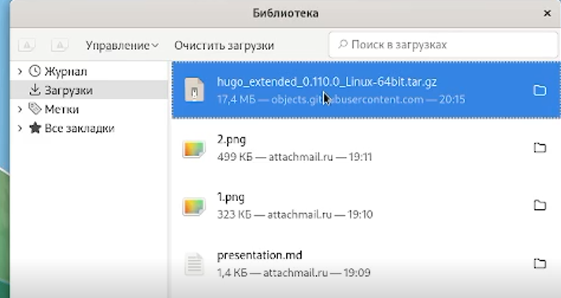{ #fig:001 width=70% }

2. Создаем папку bin и переносим туда исполняемый файл hugo (рис. [-@fig:002])

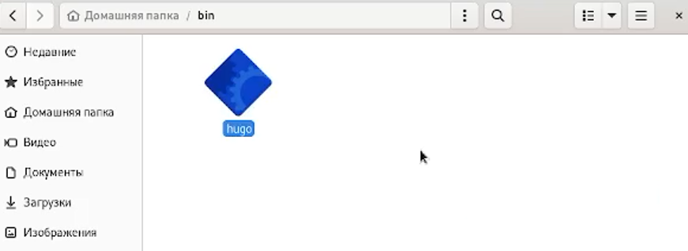{ #fig:002 width=70% }

3. Используя шаблон репозитория, который можно найти на ТУИС, при помощи кнопки Use this template на github создаём у себя новый репозиторий (рис. [-@fig:003])

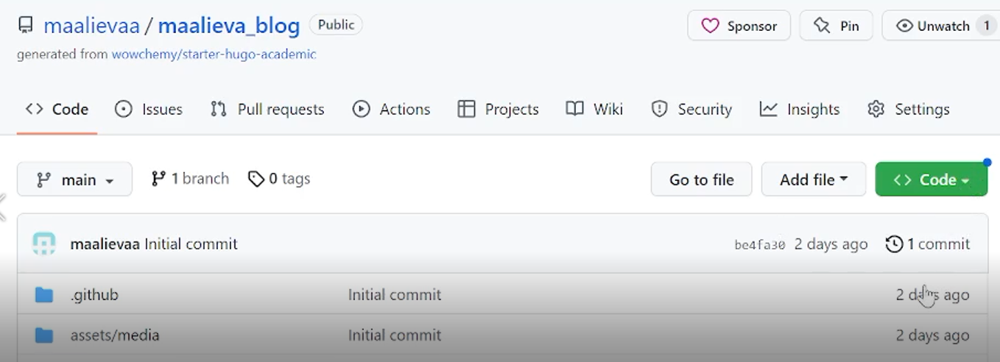{ #fig:003 width=70% }

4. Клонируем репозиторий (рис. [-@fig:004])

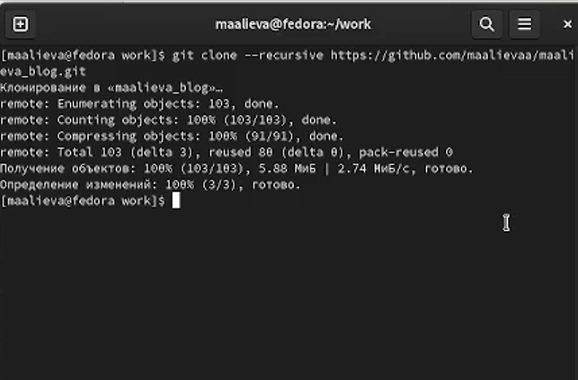{ #fig:004 width=70% }

5. Используем исполняемый файл (при помощи ~/bin/hugo) в каталоге maalieva_blog (рис. [-@fig:005])

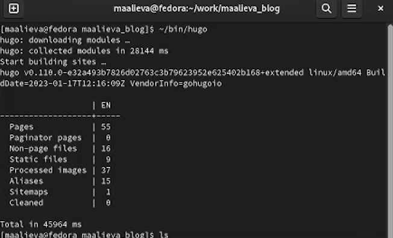{ #fig:005 width=70% }

6. Удаляем каталог public (рис. [-@fig:006]) 

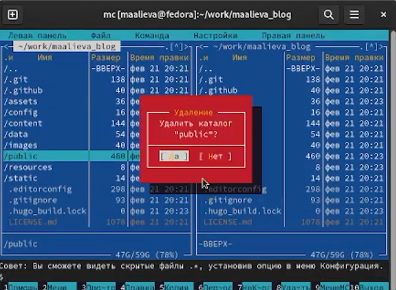{ #fig:006 width=70% }

7. Получаем ссылку на сайт при помощи команды ~bin/hugo server (рис. [-@fig:007])

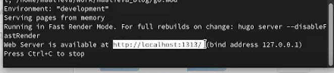{ #fig:007 width=70% }

8. Создаем еще один новый репозиторий maalievaa.github.io (рис. [-@fig:008])

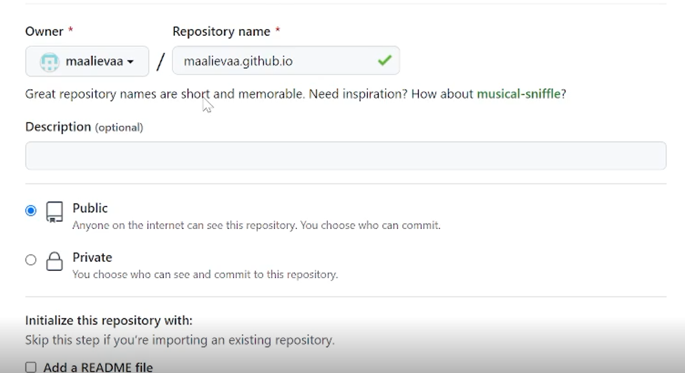{ #fig:008 width=70% }

9. Переключаемся на ветку main и создаем файл README.md с помощью команды touch, чтобы репозиторий не был пустым (рис. [-@fig:009])

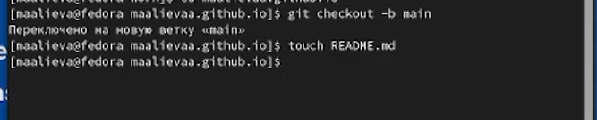{ #fig:009 width=70% }

10. Связываем новый репозиторий с папкой public из репозитория blog (рис. [-@fig:010]) 

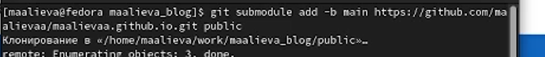{ #fig:010 width=70% }

11. Обновляем репозиторий и получаем нужные файлы в репозитории maalievaa.github.io (рис. [-@fig:011])

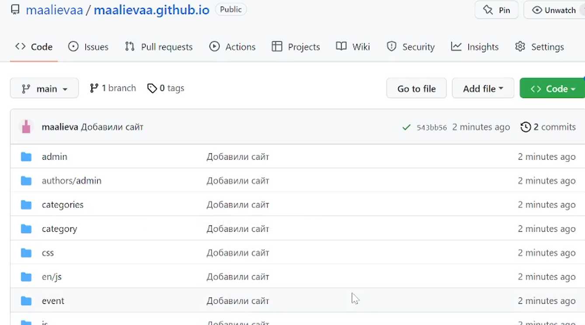{ #fig:011 width=70% }

# Выводы

Я научилась создавать сайты на Hugo.

# Список литературы{.unnumbered}

Веб-сайт - https://www.seonews.ru/glossary/veb-sayt/
