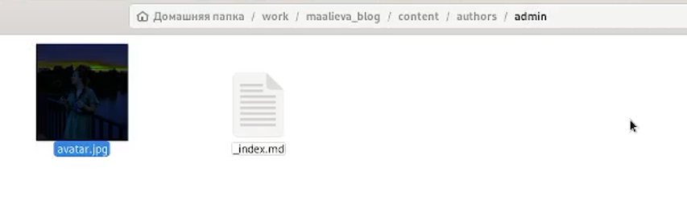
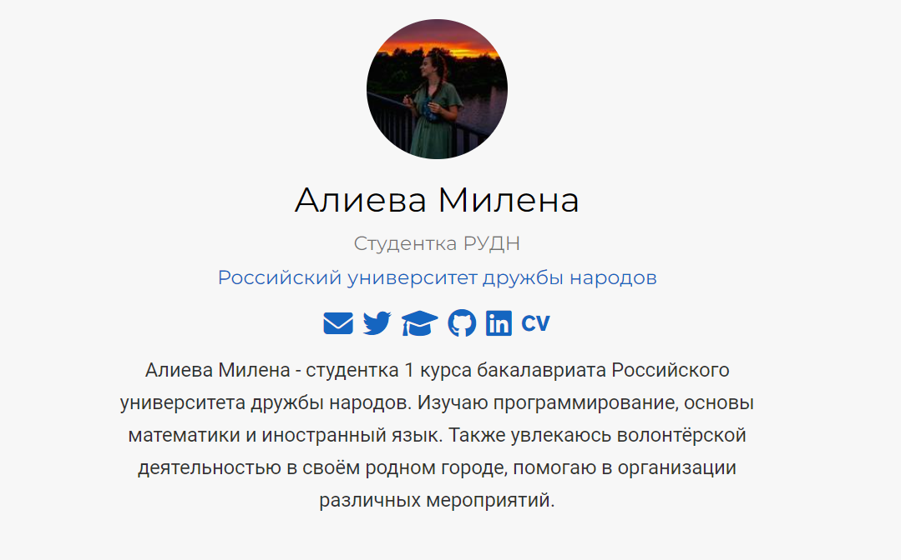
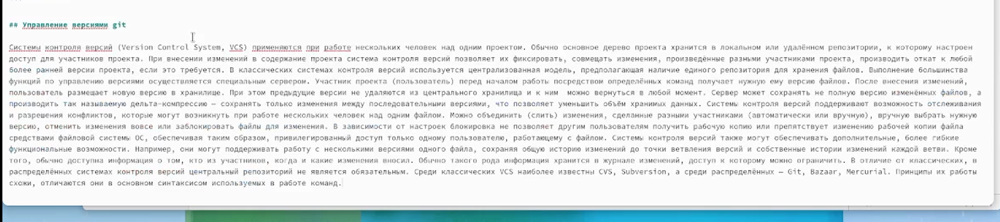
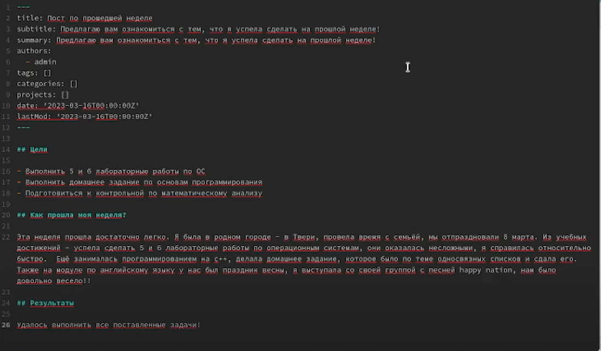
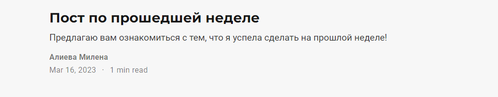

---
## Front matter
title: "Второй этап индивидуального проекта"
subtitle: "Дисциплина: Операционные системы"
author: "Алиева Милена Арифовна"

## Generic otions
lang: ru-RU
toc-title: "Содержание"

## Bibliography
bibliography: bib/cite.bib
csl: pandoc/csl/gost-r-7-0-5-2008-numeric.csl

## Pdf output format
toc: true # Table of contents
toc-depth: 2
lof: true # List of figures
lot: true # List of tables
fontsize: 12pt
linestretch: 1.5
papersize: a4
documentclass: scrreprt
## I18n polyglossia
polyglossia-lang:
  name: russian
  options:
	- spelling=modern
	- babelshorthands=true
polyglossia-otherlangs:
  name: english
## I18n babel
babel-lang: russian
babel-otherlangs: english
## Fonts
mainfont: PT Serif
romanfont: PT Serif
sansfont: PT Sans
monofont: PT Mono
mainfontoptions: Ligatures=TeX
romanfontoptions: Ligatures=TeX
sansfontoptions: Ligatures=TeX,Scale=MatchLowercase
monofontoptions: Scale=MatchLowercase,Scale=0.9
## Biblatex
biblatex: true
biblio-style: "gost-numeric"
biblatexoptions:
  - parentracker=true
  - backend=biber
  - hyperref=auto
  - language=auto
  - autolang=other*
  - citestyle=gost-numeric
## Pandoc-crossref LaTeX customization
figureTitle: "Рис."
tableTitle: "Таблица"
listingTitle: "Листинг"
lofTitle: "Список иллюстраций"
lotTitle: "Список таблиц"
lolTitle: "Листинги"
## Misc options
indent: true
header-includes:
  - \usepackage{indentfirst}
  - \usepackage{float} # keep figures where there are in the text
  - \floatplacement{figure}{H} # keep figures where there are in the text
---

# Цель работы

Научиться добавлять на сайт информацию о себе и создавать посты

# Задание

1. Разместить фотографию владельца сайта.
2. Разместить краткое описание владельца сайта (Biography).
3. Добавить информацию об интересах (Interests).
4. Добавить информацию об образовании (Education).
5. Сделать пост по прошедшей неделе.
6. Добавить пост на тему: Управление версиями. Git.

# Выполнение лабораторной работы

1. Перейдя в нужную папку, поменяли аватар (рис. [-@fig:001])

{ #fig:001 width=70% }

С помощью команд git add, git commit, git push и hugo обновили данные и увидели свой аватар на сайте. Со временем он правильно расположился и не перекрывал текст (рис. [-@fig:002])

{ #fig:002 width=70% }

2. Перейдя в папку ~/work/blog/content/authors/admin добавили информацию о себе (краткое описание владельца сайта, информацию об интересах, информацию об образовании) (рис. [-@fig:003])

{ #fig:003 width=70% }

3. Написали пост в нужном файле на тему: Управление версиями. Git  (рис. [-@fig:004])

{ #fig:004 width=70% }

Выгрузили с помощью команд git add, git commit, git push и hugo данные и увидели пост на своём сайте (рис. [-@fig:005])

{ #fig:005 width=70% }

4. Написали пост по прошедшей неделе (рис. [-@fig:006])

{ #fig:006 width=70% }

Выгрузили с помощью команд git add, git commit, git push и hugo данные и увидели пост на своём сайте (рис. [-@fig:007])

{ #fig:007 width=70% }

# Выводы

В ходе данной лабораторной работы я научилась добавлять информация о себе на созданный сайт, также ознакомилась с написанием постов с дальнейшей их выгрузкой на сайт
