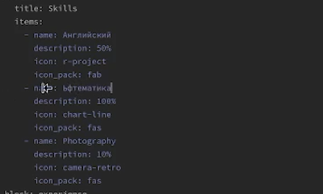
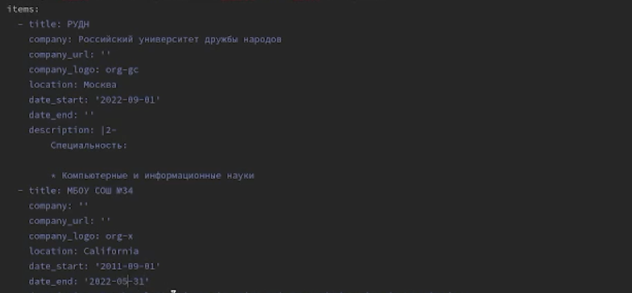
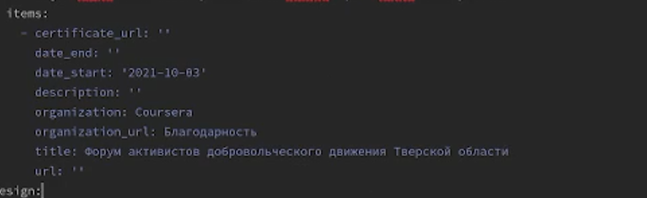
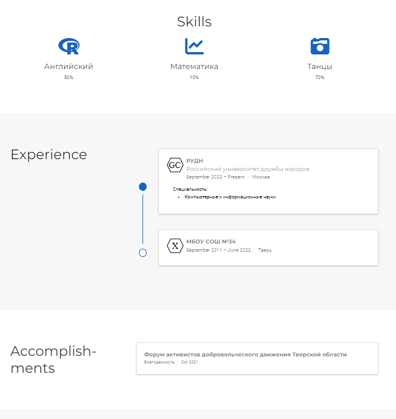
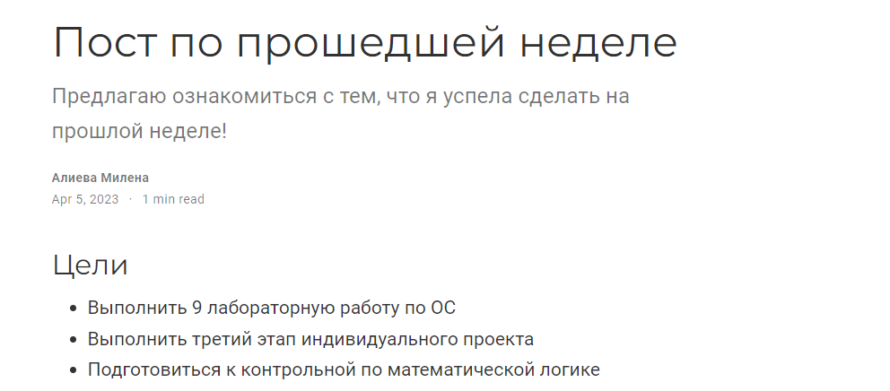
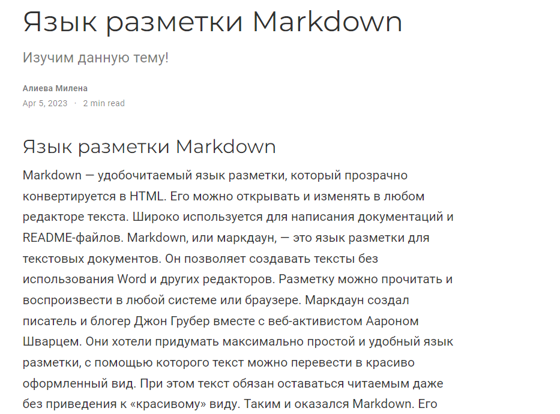

---
## Front matter
title: "Третий этап индивидуального проекта"
subtitle: "Дисциплина: Операционные системы"
author: "Алиева Милена Арифовна"

## Generic otions
lang: ru-RU
toc-title: "Содержание"

## Bibliography
bibliography: bib/cite.bib
csl: pandoc/csl/gost-r-7-0-5-2008-numeric.csl

## Pdf output format
toc: true # Table of contents
toc-depth: 2
lof: true # List of figures
lot: true # List of tables
fontsize: 12pt
linestretch: 1.5
papersize: a4
documentclass: scrreprt
## I18n polyglossia
polyglossia-lang:
  name: russian
  options:
	- spelling=modern
	- babelshorthands=true
polyglossia-otherlangs:
  name: english
## I18n babel
babel-lang: russian
babel-otherlangs: english
## Fonts
mainfont: PT Serif
romanfont: PT Serif
sansfont: PT Sans
monofont: PT Mono
mainfontoptions: Ligatures=TeX
romanfontoptions: Ligatures=TeX
sansfontoptions: Ligatures=TeX,Scale=MatchLowercase
monofontoptions: Scale=MatchLowercase,Scale=0.9
## Biblatex
biblatex: true
biblio-style: "gost-numeric"
biblatexoptions:
  - parentracker=true
  - backend=biber
  - hyperref=auto
  - language=auto
  - autolang=other*
  - citestyle=gost-numeric
## Pandoc-crossref LaTeX customization
figureTitle: "Рис."
tableTitle: "Таблица"
listingTitle: "Листинг"
lofTitle: "Список иллюстраций"
lotTitle: "Список таблиц"
lolTitle: "Листинги"
## Misc options
indent: true
header-includes:
  - \usepackage{indentfirst}
  - \usepackage{float} # keep figures where there are in the text
  - \floatplacement{figure}{H} # keep figures where there are in the text
---

# Цель работы

Научиться добавлять на сайт информацию о навыках, опыте и достижениях

# Задание

1. Добавить информацию о навыках (Skills).
2. Добавить информацию об опыте (Experience).
3. Добавить информацию о достижениях (Accomplishments).
4. Сделать пост по прошедшей неделе.
5. Добавить пост на тему: Язык разметки Markdown.

# Выполнение лабораторной работы

1. Перейдя в blog/content/index.md, добавили информацию о навыках (рис. [-@fig:001])

{ #fig:001 width=70% }

Также добавили информацию об опыте: (рис. [-@fig:002])

{ #fig:002 width=70% }

И информацию о достижениях: (рис. [-@fig:003])

{ #fig:003 width=70% }

2. Выгрузили с помощью команд git add, git commit, git push и hugo данные и убедились, что данные обновились (рис. [-@fig:004])

{ #fig:004 width=70% }

3. Также написали пост по прошедшей неделе. Выгрузили с помощью команд git add, git commit, git push и hugo данные и увидели пост на своём сайте (рис. [-@fig:005])

{ #fig:005 width=70% }

4. Написали пост на тему "Язык разметки Markdown". Выгрузили с помощью команд git add, git commit, git push и hugo данные и увидели пост на своём сайте (рис. [-@fig:006])

{ #fig:006 width=70% }

# Выводы

В ходе данной лабораторной работы я научилась добавлять информация о навыках, опыте и достижениях
