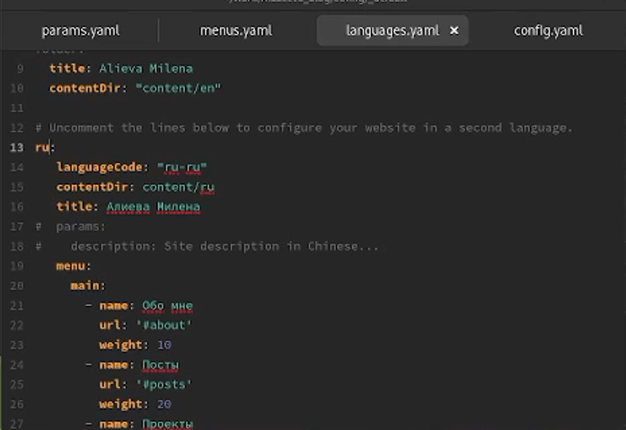
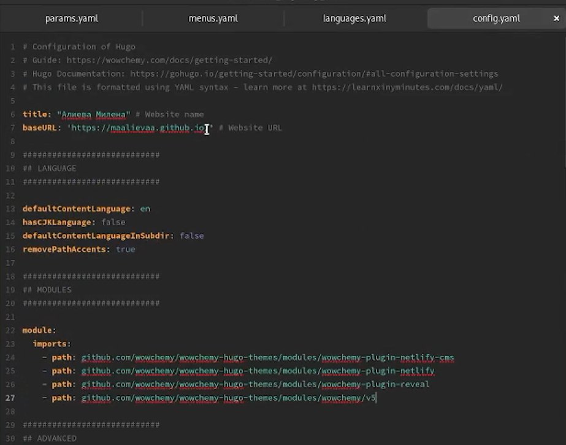
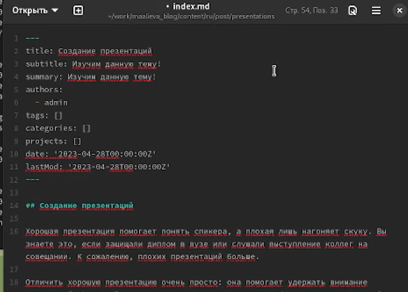
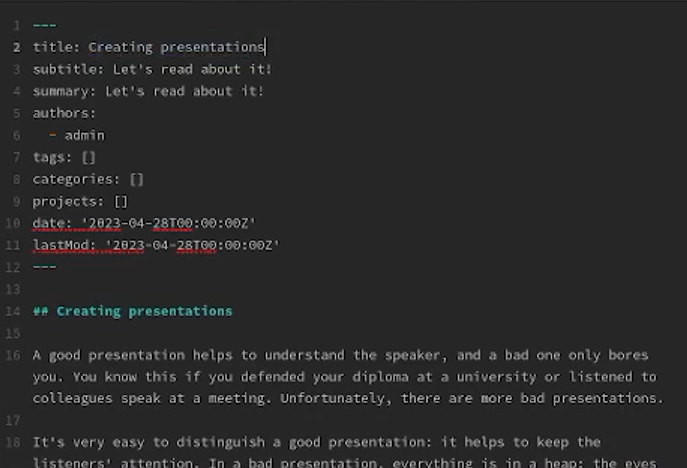
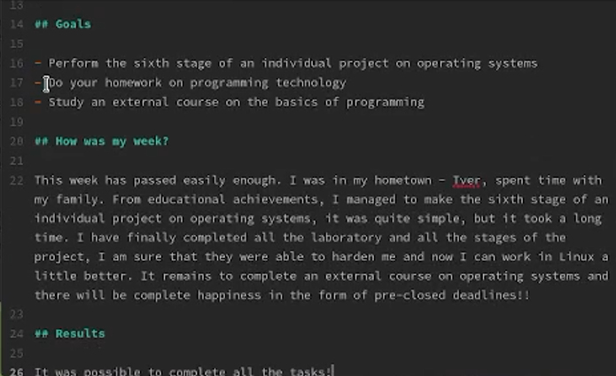
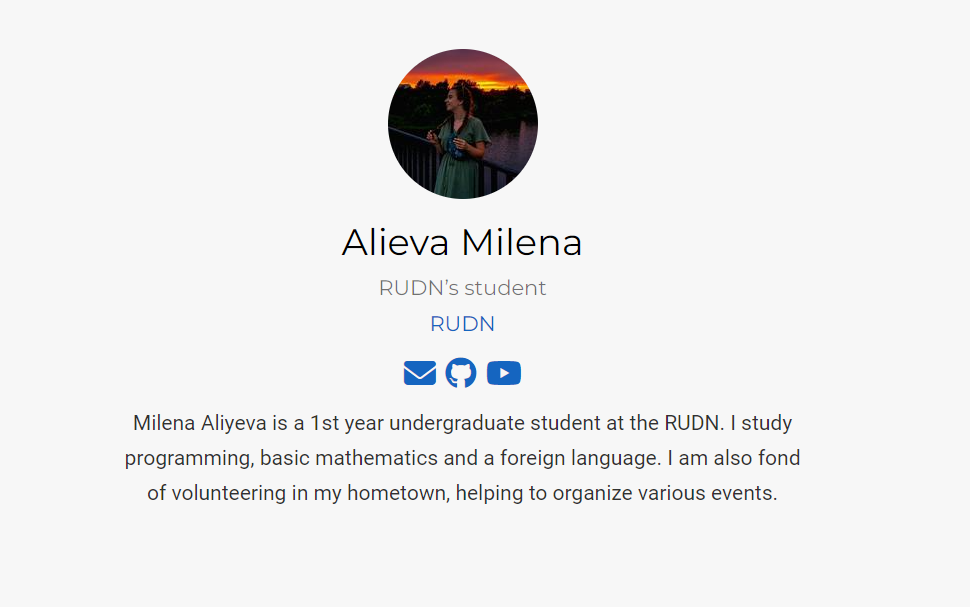
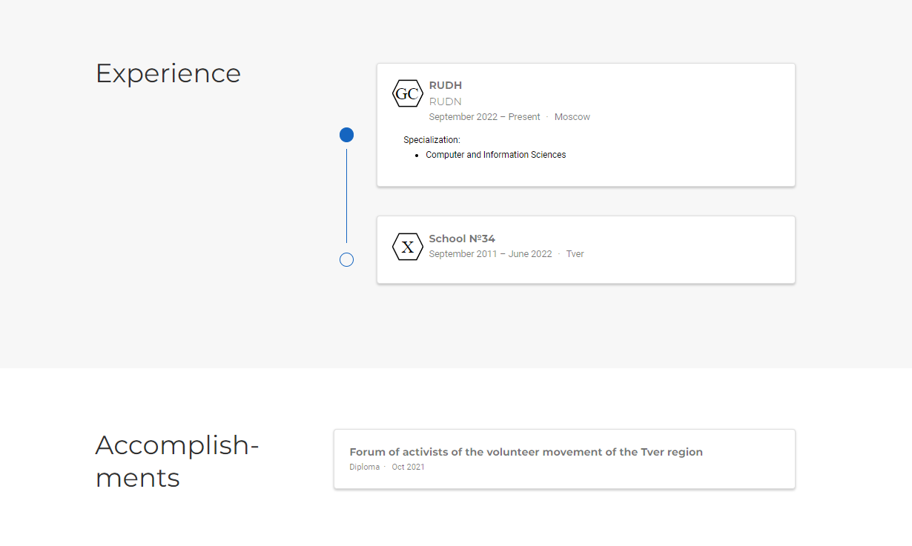
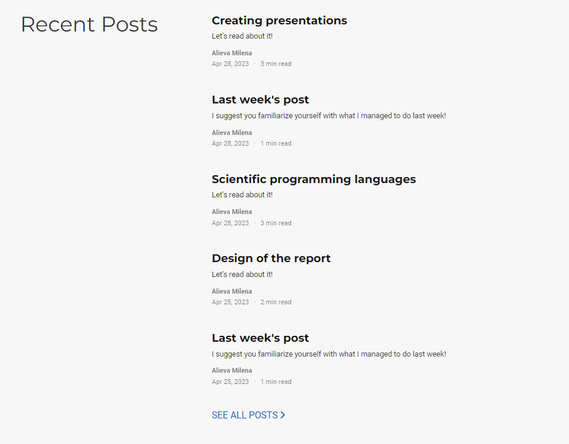

---
## Front matter
title: "Шестой этап индивидуального проекта"
subtitle: "Дисциплина: Операционные системы"
author: "Алиева Милена Арифовна"

## Generic otions
lang: ru-RU
toc-title: "Содержание"

## Bibliography
bibliography: bib/cite.bib
csl: pandoc/csl/gost-r-7-0-5-2008-numeric.csl

## Pdf output format
toc: true # Table of contents
toc-depth: 2
lof: true # List of figures
lot: true # List of tables
fontsize: 12pt
linestretch: 1.5
papersize: a4
documentclass: scrreprt
## I18n polyglossia
polyglossia-lang:
  name: russian
  options:
	- spelling=modern
	- babelshorthands=true
polyglossia-otherlangs:
  name: english
## I18n babel
babel-lang: russian
babel-otherlangs: english
## Fonts
mainfont: PT Serif
romanfont: PT Serif
sansfont: PT Sans
monofont: PT Mono
mainfontoptions: Ligatures=TeX
romanfontoptions: Ligatures=TeX
sansfontoptions: Ligatures=TeX,Scale=MatchLowercase
monofontoptions: Scale=MatchLowercase,Scale=0.9
## Biblatex
biblatex: true
biblio-style: "gost-numeric"
biblatexoptions:
  - parentracker=true
  - backend=biber
  - hyperref=auto
  - language=auto
  - autolang=other*
  - citestyle=gost-numeric
## Pandoc-crossref LaTeX customization
figureTitle: "Рис."
tableTitle: "Таблица"
listingTitle: "Листинг"
lofTitle: "Список иллюстраций"
lotTitle: "Список таблиц"
lolTitle: "Листинги"
## Misc options
indent: true
header-includes:
  - \usepackage{indentfirst}
  - \usepackage{float} # keep figures where there are in the text
  - \floatplacement{figure}{H} # keep figures where there are in the text
---

# Цель работы

Размещение двуязычного сайта на Github

# Задание

1. Сделать поддержку английского и русского языков
2. Разместить элементы сайта на обоих языках
3. Разместить контент на обоих языках
4. Сделать пост по прошедшей неделе
5. Добавить пост на тему по выбору (на двух языках): Создание презентаций

# Выполнение лабораторной работы

1. Добавили русский язык (рис. [-@fig:001])

{ #fig:001 width=70% }

{ #fig:002 width=70% }

2. Создали в папке content две папки - ru, en (рис. [-@fig:003])

{ #fig:003 width=70% }

3. Написали пост на тему по выбору (рис. [-@fig:004])

{ #fig:004 width=70% }

Перевели его на английский язык (рис. [-@fig:005])

{ #fig:005 width=70% }

4. Написали пост по прошедшей неделе (рис. [-@fig:006])

{ #fig:006 width=70% }

Перевели его на английский язык (рис. [-@fig:007])

{ #fig:007 width=70% }

5. С помощьью hugo, git add, git commit, git push обновили данные и убедились, что при выборе английского языка все отображается на нём же (рис. [-@fig:008])

{ #fig:008 width=70% }

{ #fig:009 width=70% }

{ #fig:010 width=70% }

{ #fig:011 width=70% }

# Вывод

В ходе выполнения данного этапа индивидуального проекта я научилась размещать двуязычный сайт на Github
